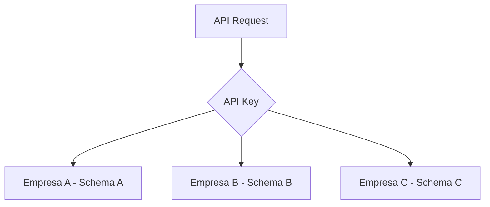
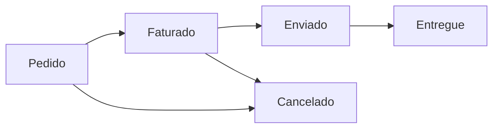

# Conceitos Principais

Antes de começar a usar a API, é importante entender alguns conceitos fundamentais do Sistema de Representantes.

## Multi-tenancy

O Sistema de Representantes é uma aplicação multi-tenant, o que significa que uma única instância da aplicação serve múltiplas empresas, cada uma com seus dados completamente isolados.

### Como funciona

- Cada empresa possui um **schema próprio** no banco de dados
- A API Key identifica automaticamente a empresa
- Não há possibilidade de acesso cruzado entre dados de diferentes empresas



## Entidades Principais

### Cliente

Representa uma empresa ou pessoa que compra produtos através do representante.

```json
{
  "id": "uuid",
  "codigo": "CLI001",
  "nome": "Empresa ABC Ltda",
  "cnpj_cpf": "12.345.678/0001-90",
  "email": "contato@empresa.com",
  "telefone": "(11) 98765-4321",
  "endereco": "Rua das Flores, 123",
  "cidade": "São Paulo",
  "estado": "SP",
  "ativo": true
}
```

### Venda

Representa uma transação comercial entre o cliente e a representada.

```json
{
  "id": "uuid",
  "pedido": "PED-2024-001",
  "data": "2024-01-20",
  "cliente_id": "uuid",
  "representada_id": "uuid",
  "status": "Faturado",
  "valor_total": 5500.00,
  "itens": [...]
}
```

### Item de Venda

Cada produto vendido dentro de uma venda.

```json
{
  "produto_id": "uuid",
  "quantidade": 10,
  "valor_unitario": 250.00,
  "valor_total": 2500.00
}
```

## Estados de uma Venda

Uma venda pode passar por diferentes estados durante seu ciclo de vida:



| Status | Descrição |
|--------|-----------|
| `Pedido` | Venda registrada, aguardando faturamento |
| `Faturado` | Nota fiscal emitida |
| `Enviado` | Mercadoria despachada |
| `Entregue` | Mercadoria recebida pelo cliente |
| `Cancelado` | Venda cancelada |

## Paginação

Todos os endpoints de listagem implementam paginação para melhor performance:

### Parâmetros

- `page`: Número da página (começa em 1)
- `limit`: Quantidade de registros por página (máximo 100)

### Resposta

```json
{
  "data": [...],
  "page": 1,
  "limit": 20,
  "total": 150
}
```

### Navegação

```javascript
// Primeira página
GET /api/v1/clients?page=1&limit=20

// Próxima página
GET /api/v1/clients?page=2&limit=20

// Última página
const lastPage = Math.ceil(total / limit);
GET /api/v1/clients?page=${lastPage}&limit=20
```

## Busca e Filtros

### Busca em Clientes

O parâmetro `search` permite buscar em múltiplos campos:

- Nome
- Código
- Cidade
- Email

```bash
GET /api/v1/clients?search=paulo
```

Retorna clientes onde:
- Nome contém "paulo" OU
- Cidade contém "paulo" (ex: São Paulo) OU
- Email contém "paulo"

## Formato de Datas

A API usa o padrão ISO 8601 para todas as datas:

- **Data e hora**: `2024-01-20T15:30:00Z`
- **Apenas data**: `2024-01-20`

### Timezone

- Todas as datas são armazenadas em UTC
- Conversões de timezone devem ser feitas no cliente

```javascript
// Converter UTC para horário local
const utcDate = "2024-01-20T15:30:00Z";
const localDate = new Date(utcDate).toLocaleString('pt-BR', {
  timeZone: 'America/Sao_Paulo'
});
```

## Valores Monetários

- Todos os valores são em **Reais (BRL)**
- Valores são representados como números decimais
- Sempre com 2 casas decimais de precisão

```json
{
  "valor_unitario": 250.00,
  "valor_total": 2500.00,
  "currency": "BRL"
}
```

## IDs e Códigos

### UUID

Todos os IDs internos são UUIDs v4:

```
123e4567-e89b-12d3-a456-426614174000
```

### Códigos Personalizados

Alguns recursos permitem códigos personalizados:

- **Cliente**: Campo `codigo` (ex: "CLI001")
- **Pedido**: Gerado automaticamente se não fornecido (ex: "PED-2024-001")

## Rate Limiting

A API implementa rate limiting para garantir disponibilidade:

### Limites

- 1000 requisições por hora por API key
- 10 requisições simultâneas

### Headers de Resposta

```
x-rate-limit-limit: 1000
x-rate-limit-remaining: 950
x-rate-limit-reset: 1705764000
```

### Estratégia de Retry

Quando atingir o limite, aguarde o tempo indicado:

```javascript
if (response.status === 429) {
  const resetTime = response.headers.get('x-rate-limit-reset');
  const waitTime = resetTime - Math.floor(Date.now() / 1000);
  
  console.log(`Aguardando ${waitTime} segundos...`);
  await sleep(waitTime * 1000);
}
```

## Versionamento

A API usa versionamento na URL:

- Versão atual: `v1`
- URL base: `https://api.sistema-representantes.com.br/api/v1`

### Política de Depreciação

- Novas versões são anunciadas com 6 meses de antecedência
- Versões antigas mantidas por no mínimo 12 meses
- Headers de aviso em versões depreciadas

```
Deprecation: true
Sunset: 2025-01-01T00:00:00Z
```